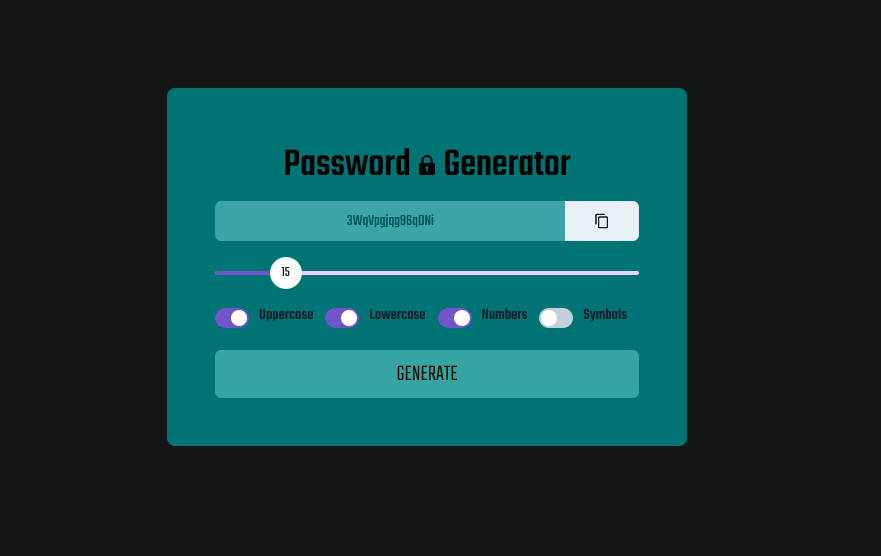

# React Password Generator

  

A simple password generator

View the deployed application <a href = "https://react-passwordgen.netlify.app/">here</a>

## Table of Contents

- [Installation](#installation)
- [Usage](#usage)
- [Resources](#resources)
- [Contributions](#contributions)
- [Testing](#testing)
- [Questions](#questions)
- [License](#license)

## Installation

If you would like to use the application in your local environment:

1. Clone the repo
2. Install required dependencies by running command `npm i`
3. Run command `npm start` to launch the development server

Otherwise, visit the deployed application <a href = "https://react-passwordgen.netlify.app/">here</a>

## Usage

1. Choose the length of your password with the slider
2. Select the character types you would like in your password
3. Click the "Generate" button
4. Click the icon in the input field to copy the password to your clipboard

## Resources

**React**  
**Chakra UI**  
**Google Fonts**  

## Contributions

All contributions to this project are welcome! Clone down the repo to your local machine, commit changes, push to GitHub, and open a pull request!

## Testing

No tests are set up for React Password Generator at this time. Feel free to write tests or search the application for bugs.

## Questions

If you have any further questions, feel free to reach out to me!  
<a href='https://www.github.com/twkirkpatrick'>Github</a>  
<a href='mailto:twk4491@gmail.com'>twk4491@gmail.com</a>

## License

Usage is provided under the MIT license.
